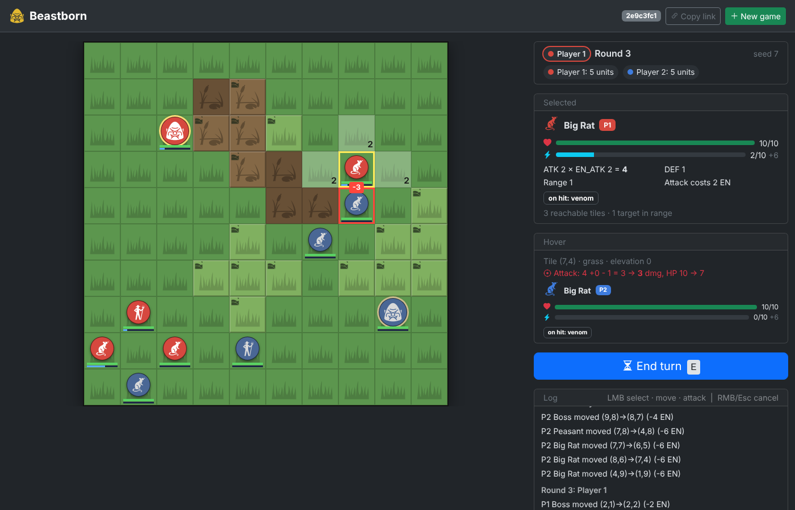

# Beastborn

Turn-based tactics for 2–4 hot-seat players. Beasts fight on a random battlefield with mud and hills.
**Combat has zero randomness.** What happens depends only on energy, position and unit stats.

Made with fun by Patryk Motyczyński.



## Run

```bash
python -m venv venv
venv\Scripts\activate            # Windows  (Linux/macOS: source venv/bin/activate)
pip install -r requirements.txt

python main.py                   # then open http://127.0.0.1:8000 and press Start
python main.py --port 9000 --reload   # other port, auto-restart on code changes
```

Requires Python 3.10+ and Flask. Choose players (2–4), map size and an optional seed, then press **Start**.
Every game gets its own id in the URL (`/?game=<id>`). Refreshing the page keeps the game, and several games can run at once.
Games live in server memory. They are lost when the server stops and expire after 2 h without activity.
Settings: `BEASTBORN_SESSION_TTL` (seconds, default 7200) and `BEASTBORN_MAX_GAMES` (default 500).

## Test

```bash
python -m pytest
```

## Rules in short

- **Win:** kill every enemy Boss. If your Boss dies, your whole army leaves the battlefield.
- **Turn:** at the start of your turn each of your units regenerates `REG_EN` energy (up to `MAX_EN`), then status effects tick (Venom).
  Units start a game with 0 energy. Then use your units in any order and end the turn.
- **Movement** (4 directions, units block tiles):

  | Step into… | Cost |
  |---|---|
  | grass, same level | 2 EN |
  | mud, same level | 3 EN |
  | each level uphill | +2 EN |
  | downhill into grass | 2 EN |
  | downhill into mud | 5 EN |

- **Attack** (adjacent enemy, costs `EN_ATK`, repeat while energy lasts):
  `DMG = ATK × EN_ATK + EM − current DEF`, minimum 1.
  - `EM` = +2 per level you stand above the target.
  - Units standing in mud have −2 DEF (never below 0).
- **Effects:** Venom = lose HP at the start of each of your turns, for a few turns. Acid = −1 DEF permanently per hit.

| Unit | HP | ATK | EN_ATK | DEF | MAX_EN | REG_EN | Special |
|---|---|---|---|---|---|---|---|
| Boss | 40 | 3 | 2 | 3 | 6 | 3 | slow, huge HP |
| Big Rat | 10 | 2 | 2 | 1 | 10 | 6 | Venom 1 HP × 3 turns |
| Peasant | 14 | 2 | 3 | 2 | 8 | 5 | — |

Stats are placeholders for balancing. Edit them in `beastborn/data/units.json`.

## Controls (browser)

| Action | Input |
|---|---|
| Select own unit | Left click |
| Move | Left click a highlighted tile (number = EN cost) |
| Attack | Left click an enemy with a red frame (hover shows exact damage) |
| Deselect | Right click / Esc |
| Preview | Hover: path + move cost, or exact damage on a target |
| End turn | E / Space / button |

## Project layout

```
beastborn/
  domain/    pure data: Position, Tile, Board, UnitStats/UnitState, effects, roster loader
  engine/    Calculation Engine (CE): interface + StandardCalculationEngine + RulesConfig
  game/      Game State Machine (GSM): state, commands, events, pathfinding, map generator, setup
  control/   player controllers (human now, bots later)
  ui/        frontend-neutral intents + presenter (interface.py, interaction.py, text.py)
    web/     Flask backend (sessions, JSON API) + static/ page (jQuery + Bootstrap)
  data/      units.json
tests/       pytest suite (engine, GSM, map, UI, web API, architecture rules)
tools/       fetch_assets.py - re-downloads vendor libraries and icons
docs/        architecture.md
main.py      entry point (web server)
```

## Web API

| Method | Path | Body |
|---|---|---|
| `POST` | `/api/games` | `{"players": 2, "size": 12, "seed": null}` → new game state |
| `GET` | `/api/games/{id}` | → state |
| `POST` | `/api/games/{id}/intents` | `{"type": "click", "x": 3, "y": 5}` / `{"type": "end_turn"}` / `{"type": "cancel"}` → state |
| `DELETE` | `/api/games/{id}` | → 204 |

## Credits

Icons by Delapouite, Lorc & Sbed from [game-icons.net](https://game-icons.net) (CC BY 3.0).
jQuery, Bootstrap and Bootstrap Icons (MIT). See `beastborn/ui/web/static/CREDITS.md`.

See [docs/architecture.md](docs/architecture.md) for how to swap the rules or the UI.
